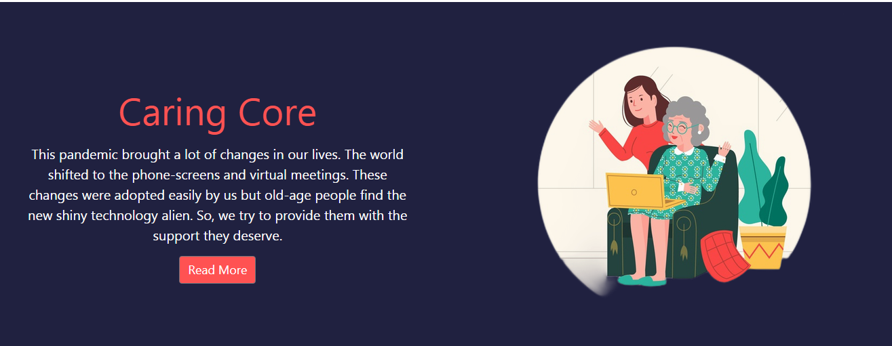

  
   
  

# CaringCore
This pandemic brought a lot of changes in our lives, which were adopted easily by us but old-age people find new shiny technology alien. So, we try to provide them with the support they deserve.

## Inspiration
This pandemic turned our lives upside down. Everything changed all of a sudden. Our lives shifted to phone screens and virtual meetings. We were easy to pick up these technologies and move forward while the old-age people struggled. Learning to use the new smartphones brought another challenge for the senior citizens as this technology is alien to them. We have tried to make their lives easier by taking care of their health through smart medicine boxes as well as updating them with the latest technology and provide resources for their well-being.

## What it does
The smart medicine box keeps track of the medicine that needs to be taken during the week and it indicates whether the medicine has been taken or not.
The website provides resources for well-being and learning new technology so that old-age people can stay updated and know the world around them better.

## How we built it
The website is built using HTML/CSS, JavaScript, and BootStrap. The hardware Setup Consists of two things (1) a Health monitor device built through Max30102 sensor, LM35, and PPG sensor (2) Smart Pill Box which built through an RTC module, Amplifier, and ESP module.
